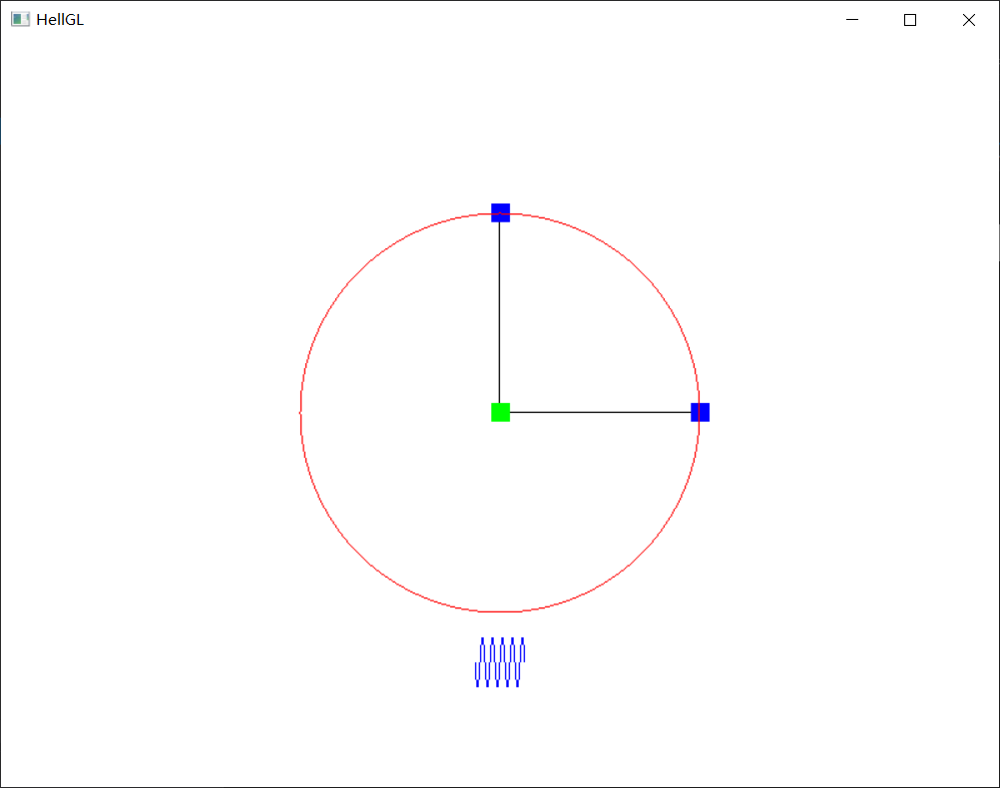
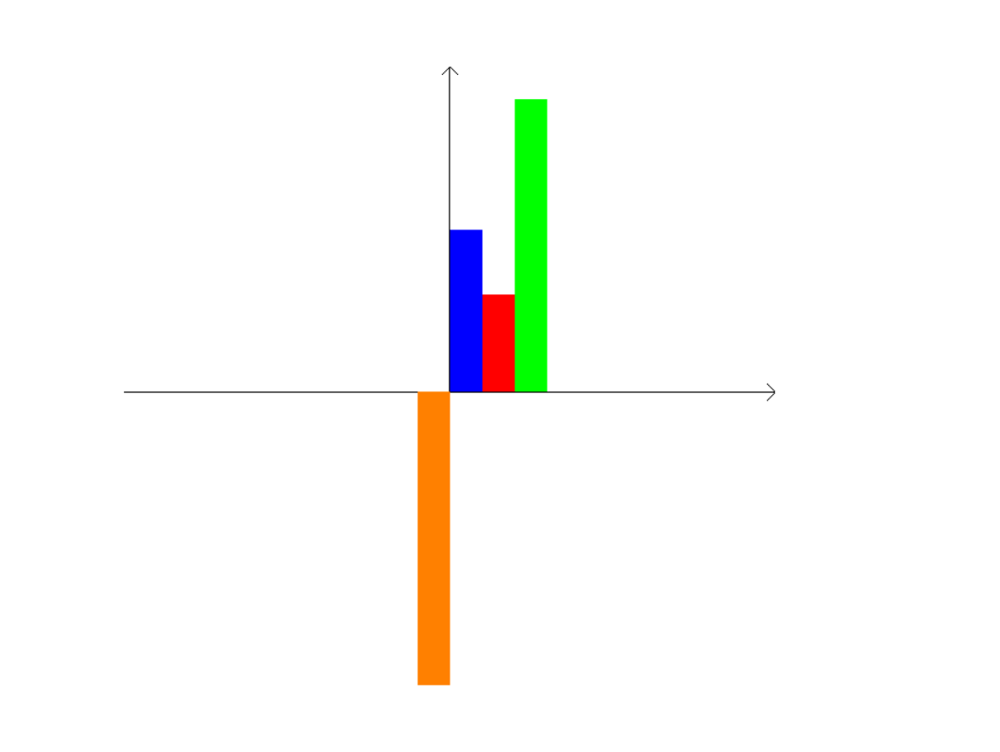

# 计算机图形学

## 第一周作业

[🔗第一周作业实验参考网址](http://www.glprogramming.com/red/chapter01.html)

1. 考虑三个不同的光栅系统，分辨率依次为 $800 \times 600$、$1280 \times 960$、$1680 \times 1050$。

   - 如果每个像素存储16位，那么这个系统各需要多大的帧内存（字节数）？
   - 如果每个像素存储32位，这些系统各需多大的存储量？

   答：

   - 16位: $800 \times 600 = \frac{800 \times 600 \times 16}{8} =  960000B \\ 1280 \times 960 = \frac{1280 \times 960 \times 16}{8}= 2457600B\\ 1680 \times 1050 = \frac{1680 \times 1050 \times 16}{8} = 3528000B $ 
   - 如果为32位，系统所需存储量
     - $800 \times 600 = \frac{800 \times 600 \times 32}{8 \times 2^{10} \times 2^{10}} = 1.83MB$
     - $1280 \times 960 = \frac{1280 \times 960 \times 32}{8 \times 2^{10} \times 2^{10}} = 4.6875MB$
     - $1680 \times 1050 = \frac{1680 \times 1050 \times 32}{8 \times 2^{10} \times 2^{10}} = 6.729 MB$

2. 考虑分辨率为$800 \times 600$ 和 $1680 \times 1050$ 的两个光栅系统。

   - 若显示控制器刷新率为每秒60帧，那么在各个系统中，每秒应访问多少像素？
     - 每秒访问像素： $800 \times 600 =  800 \times 600 \times 60 = 28800000 \\ 1680 \times 1050 = 1680 \times 1050 \times60 = 105840000$
   - 各个系统访问每个像素的时间是多少？
     -  访问每个像素的时间：$800 \times 600 =\frac{1}{800 \times 600 \times 60} = \frac{1}{28800000} = 3.472 \times 10^{-8} s\\  1680 \times 1050 = \frac{1}{1680 \times 1050 \times60} = \frac{1}{105840000} = 9.448 \times 10^{-9} s$

3. 显示窗口宽度为 $150$，高度为 $250$，请列出从窗口右上角到左下角绘制一根线段的 `OpenGL` 语句。

   答：

   ```c++
   glBegin(GL_LINES);
   
   	glVertex2i(150,0);
   
   	glVertex2i(0,250);
   
   glEnd();
   
   ```

4. 请说明 `OpenGL` 基本库、`OpenGL` 实用库(`GLU`) 及 `OpenGL` 实用函数工具包 (`GLUT`) 之间的差别。

   答：`OpenGL` 中的 `GL` 库是是核心库，`GLU` 是实用库，`GLUT` 是实用工具包

   `GL` 是核心，`GLU` 是对 `GL` 的部分封装， `GLUT` 是 `OpenGL` 跨平台工具库。

   `GL` 中包含最基本的3D函数，而 `GLU` 类似于对 `GL` 的辅助，在没有 `GLU` 的情况下，一样可以做出相同的效果。

   `GLUT` 是基本的窗口界面，如果不喜欢用 `GLUT` 可以用其他的窗口替代，但是 `GLUT` 是跨平台的，这就保证了编出的程序是跨平台的，采用其他的技术只能在自己的操作系统上使用，移植性会很差。

   `GLUT` 也不是 `OpenGL` 必须的，但是可以为学习带来一定程度上的便利。

   

5. 请说明术语 `OpenGL 显示回调函数`的含义。

   答：显示回调函数是程序员自己编写的关于显示窗口内容的函数，由 `glutDisplayFunc` 作为显示窗口需要重新显示时引入的函数来注册。当一个窗口的图像层需要重新绘制时，`GLUT` 将调用该窗口的显示回调函数。

6. 请说明物体坐标系和世界坐标系的差别

   答：

   - 建模坐标系：在构建单独对象时参照的坐标系
   
   - 世界坐标系：系统的绝对坐标系

## 实验二: OpenGL基本图元

### 任务1: 绘制圆和余弦函数

-  学会使用`GL_POINTS`、`GL_LINES`、`GL_LINE_LOOP`、`GL_LINE_STRIP`绘制基本二维形状
- 理解OpenGL状态机概念：
  - 使用`glPointSize()`设置点大小
  - 使用`glLIneWidth()`设置线的粗细
  - 使用`glColor3f()`设置颜色

#### 源代码：

```c++
#define GLEW_STATIC
#define FREEGLUT_STATIC

/*
* Include the OpenGL releated libs' head files
*/
#include <GL/glew.h>
#include <GL/freeglut.h>
#include <GL/glext.h>
#include <cmath>

int n = 10000;
float PI = 3.1415926f;
float R = 8.0f;

void init() {
	glClearColor(1.0f, 1.0f, 1.0f, 1.0f);
}

void line() {
	glColor3f(0.f, 0.f, 1.f);
	GLfloat x = -1.0;
	glClear(GL_COLOR_BUFFER_BIT);
	glBegin(GL_LINE_STRIP);
	for (float x = -5 * PI; x < 5 * PI; x += 0.1f) {
		glVertex2f(x / (5 * PI), sin(x) - 10);
	}
	glEnd();
	//横线
	glColor3f(0.f, 0.f, 0.f);
	glBegin(GL_LINES);
	glVertex2f(0.0f, 0.0f);
	glVertex2f(8.0f, 0.0f);
	glEnd();
	//竖线
	glColor3f(0.f, 0.f, 0.f);
	glBegin(GL_LINES);
	glVertex2f(0.0f, 0.0f);
	glVertex2f(0.0f, 8.0f);
	glEnd();
	//绿点
	glColor3f(0.f, 1.f, 0.f);
	glPointSize(15);
	glBegin(GL_POINTS);
	glVertex2f(0.f, 0.f);
	glEnd();
	//右蓝点
	glColor3f(0.f, 0.f, 1.f);
	glPointSize(15);
	glBegin(GL_POINTS);
	glVertex2f(8.0f, 0.f);
	glEnd();
	//上蓝点
	glColor3f(0.f, 0.f, 1.f);
	glPointSize(15);
	glBegin(GL_POINTS);
	glVertex2f(0.f, 8.0f);
	glEnd();
	glFlush();
}
void circle() {
	glColor3f(1.f, 0.f, 0.f);
	glBegin(GL_LINE_STRIP);
	for (int i = 0; i < n; i++) {
		glVertex2f(R * cos(4 * PI * i / n), R * sin(4 * PI * i / n));
	}
	int i = 0;
	glVertex2f(R * cos(4 * PI * i / n), R * sin(4 * PI * i / n));
	glEnd();
	glFlush();
}
void display() {
	glClear(GL_COLOR_BUFFER_BIT);
	line();
	circle();
	glutSwapBuffers();
}

```

#### 实验效果




### 任务2: 绘制柱状图

理解物体坐标系、世界坐标系以及两者之间的关系，尝试使用 `glTranslate*()` 函数进行模型变换。学会使用`GL_TRIANGLE_STRIP` 绘制二维实体。 实验设计：先设计好坐标轴，然后画好箭头，以此坐标轴为基础进行柱状图的绘制，然后用 `GL_TRIANGLE_STRIP` 函数用4个点实现绘制柱状图

#### 源代码

```c++
#include <GL/glew.h>
#include <GL/freeglut.h>
#include <GL/glext.h>
#include <cmath>

int n = 1e4;
float PI = 3.1415926f;
float R = 4.0f;

void init() {
	glClearColor(1.0f, 1.0f, 1.0f, 1.0f);
}

void axis()
{
	glColor3f(0.f, 0.f, 0.f);
	glBegin(GL_LINES);
	// 坐标十字线
	glVertex2f(-10.0, 0.0f);
	glVertex2f(10.0f, 0.0f);
	glVertex2f(0.0f, 10.0f);
	glVertex2f(0.0f, 0.0f);
	// axis 1
	glVertex2f(9.75f, 0.25f);
	glVertex2f(10.0f, 0.0f);
	glVertex2f(9.75f, -0.25f);
	glVertex2f(10.0f, 0.0f);
	// axis 2
	glVertex2f(-0.25f, 9.75f);
	glVertex2f(0.0f, 10.0f);
	glVertex2f(0.25f, 9.75f);
	glVertex2f(0.0f, 10.0f);

	glEnd();
}

void rectangle(double R, double G, double B, double x, double y, double width, double height)
{
	glColor3f(R, G, B);
	glPointSize(1.f);
	glBegin(GL_TRIANGLE_STRIP);
	glVertex2f(x, y);
	glVertex2f(x, y + height);
	glVertex2f(x + width, y);
	glVertex2f(x + width, y + height);
	glEnd();
}

void display() {
	glClear(GL_COLOR_BUFFER_BIT);
	axis();
	rectangle(1.0, 0.5, 0.0, -1.0, 0.0, 1.0, -9.0);
	rectangle(0.0, 0.0, 1.0, 0.0, 0.0, 1.0, 5.0);
	rectangle(1.0, 0.0, 0.0, 1.0, 0.0, 1.0, 3.0);
	rectangle(0.0, 1.0, 0.0, 2.0, 0.0, 1.0, 9.0);
	glutSwapBuffers();
}
```

#### 实验效果

