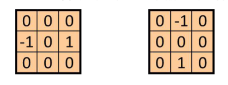

# 计算机图形学

## 第一周作业

[🔗第一周作业实验参考网址](http://www.glprogramming.com/red/chapter01.html)

1. 考虑三个不同的光栅系统，分辨率依次为 $800 \times 600$、$1280 \times 960$、$1680 \times 1050$。

   - 如果每个像素存储16位，那么这个系统各需要多大的帧内存（字节数）？
   - 如果每个像素存储32位，这些系统各需多大的存储量？

   答：

   - 16位: $800 \times 600 = \frac{800 \times 600 \times 16}{8} =  960000B \\ 1280 \times 960 = \frac{1280 \times 960 \times 16}{8}= 2457600B\\ 1680 \times 1050 = \frac{1680 \times 1050 \times 16}{8} = 3528000B $ 
   - 如果为32位，系统所需存储量
     - $800 \times 600 = \frac{800 \times 600 \times 32}{8 \times 2^{10} \times 2^{10}} = 1.83MB$
     - $1280 \times 960 = \frac{1280 \times 960 \times 32}{8 \times 2^{10} \times 2^{10}} = 4.6875MB$
     - $1680 \times 1050 = \frac{1680 \times 1050 \times 32}{8 \times 2^{10} \times 2^{10}} = 6.729 MB$

2. 考虑分辨率为$800 \times 600$ 和 $1680 \times 1050$ 的两个光栅系统。

   - 若显示控制器刷新率为每秒60帧，那么在各个系统中，每秒应访问多少像素？
     - 每秒访问像素： $800 \times 600 =  800 \times 600 \times 60 = 28800000 \\ 1680 \times 1050 = 1680 \times 1050 \times60 = 105840000$
   - 各个系统访问每个像素的时间是多少？
     -  访问每个像素的时间：$800 \times 600 =\frac{1}{800 \times 600 \times 60} = \frac{1}{28800000} = 3.472 \times 10^{-8} s\\  1680 \times 1050 = \frac{1}{1680 \times 1050 \times60} = \frac{1}{105840000} = 9.448 \times 10^{-9} s$

3. 显示窗口宽度为 $150$，高度为 $250$，请列出从窗口右上角到左下角绘制一根线段的 `OpenGL` 语句。

   答：

   ```c++
   glBegin(GL_LINES);
   
   	glVertex2i(150,0);
   
   	glVertex2i(0,250);
   
   glEnd();
   
   ```

4. 请说明 `OpenGL` 基本库、`OpenGL` 实用库(`GLU`) 及 `OpenGL` 实用函数工具包 (`GLUT`) 之间的差别。

   答：`OpenGL` 中的 `GL` 库是是核心库，`GLU` 是实用库，`GLUT` 是实用工具包

   `GL` 是核心，`GLU` 是对 `GL` 的部分封装， `GLUT` 是 `OpenGL` 跨平台工具库。

   `GL` 中包含最基本的3D函数，而 `GLU` 类似于对 `GL` 的辅助，在没有 `GLU` 的情况下，一样可以做出相同的效果。

   `GLUT` 是基本的窗口界面，如果不喜欢用 `GLUT` 可以用其他的窗口替代，但是 `GLUT` 是跨平台的，这就保证了编出的程序是跨平台的，采用其他的技术只能在自己的操作系统上使用，移植性会很差。

   `GLUT` 也不是 `OpenGL` 必须的，但是可以为学习带来一定程度上的便利。

   

5. 请说明术语 `OpenGL 显示回调函数`的含义。

   答：显示回调函数是程序员自己编写的关于显示窗口内容的函数，由 `glutDisplayFunc` 作为显示窗口需要重新显示时引入的函数来注册。当一个窗口的图像层需要重新绘制时，`GLUT` 将调用该窗口的显示回调函数。

6. 请说明物体坐标系和世界坐标系的差别

   答：

   - 建模坐标系：在构建单独对象时参照的坐标系
   
   - 世界坐标系：系统的绝对坐标系

## 实验二: OpenGL基本图元

### 任务1: 绘制圆和余弦函数

-  学会使用`GL_POINTS`、`GL_LINES`、`GL_LINE_LOOP`、`GL_LINE_STRIP`绘制基本二维形状
- 理解OpenGL状态机概念：
  - 使用`glPointSize()`设置点大小
  - 使用`glLIneWidth()`设置线的粗细
  - 使用`glColor3f()`设置颜色

#### 源代码：

```c++
#define GLEW_STATIC
#define FREEGLUT_STATIC

/*
* Include the OpenGL releated libs' head files
*/
#include <GL/glew.h>
#include <GL/freeglut.h>
#include <GL/glext.h>
#include <cmath>

int n = 10000;
float PI = 3.1415926f;
float R = 8.0f;

void init() {
	glClearColor(1.0f, 1.0f, 1.0f, 1.0f);
}

void line() {
	glColor3f(0.f, 0.f, 1.f);
	GLfloat x = -1.0;
	glClear(GL_COLOR_BUFFER_BIT);
	glBegin(GL_LINE_STRIP);
	for (float x = -5 * PI; x < 5 * PI; x += 0.1f) {
		glVertex2f(x / (5 * PI), sin(x) - 10);
	}
	glEnd();
	//横线
	glColor3f(0.f, 0.f, 0.f);
	glBegin(GL_LINES);
	glVertex2f(0.0f, 0.0f);
	glVertex2f(8.0f, 0.0f);
	glEnd();
	//竖线
	glColor3f(0.f, 0.f, 0.f);
	glBegin(GL_LINES);
	glVertex2f(0.0f, 0.0f);
	glVertex2f(0.0f, 8.0f);
	glEnd();
	//绿点
	glColor3f(0.f, 1.f, 0.f);
	glPointSize(15);
	glBegin(GL_POINTS);
	glVertex2f(0.f, 0.f);
	glEnd();
	//右蓝点
	glColor3f(0.f, 0.f, 1.f);
	glPointSize(15);
	glBegin(GL_POINTS);
	glVertex2f(8.0f, 0.f);
	glEnd();
	//上蓝点
	glColor3f(0.f, 0.f, 1.f);
	glPointSize(15);
	glBegin(GL_POINTS);
	glVertex2f(0.f, 8.0f);
	glEnd();
	glFlush();
}
void circle() {
	glColor3f(1.f, 0.f, 0.f);
	glBegin(GL_LINE_STRIP);
	for (int i = 0; i < n; i++) {
		glVertex2f(R * cos(4 * PI * i / n), R * sin(4 * PI * i / n));
	}
	int i = 0;
	glVertex2f(R * cos(4 * PI * i / n), R * sin(4 * PI * i / n));
	glEnd();
	glFlush();
}
void display() {
	glClear(GL_COLOR_BUFFER_BIT);
	line();
	circle();
	glutSwapBuffers();
}

```

#### 实验效果


### 任务2: 绘制柱状图

理解物体坐标系、世界坐标系以及两者之间的关系，尝试使用 `glTranslate*()` 函数进行模型变换。学会使用`GL_TRIANGLE_STRIP` 绘制二维实体。 实验设计：先设计好坐标轴，然后画好箭头，以此坐标轴为基础进行柱状图的绘制，然后用 `GL_TRIANGLE_STRIP` 函数用4个点实现绘制柱状图

#### 源代码

```c++
#include <GL/glew.h>
#include <GL/freeglut.h>
#include <GL/glext.h>
#include <cmath>

int n = 1e4;
float PI = 3.1415926f;
float R = 4.0f;

void init() {
	glClearColor(1.0f, 1.0f, 1.0f, 1.0f);
}

void axis()
{
	glColor3f(0.f, 0.f, 0.f);
	glBegin(GL_LINES);
	// 坐标十字线
	glVertex2f(-10.0, 0.0f);
	glVertex2f(10.0f, 0.0f);
	glVertex2f(0.0f, 10.0f);
	glVertex2f(0.0f, 0.0f);
	// axis 1
	glVertex2f(9.75f, 0.25f);
	glVertex2f(10.0f, 0.0f);
	glVertex2f(9.75f, -0.25f);
	glVertex2f(10.0f, 0.0f);
	// axis 2
	glVertex2f(-0.25f, 9.75f);
	glVertex2f(0.0f, 10.0f);
	glVertex2f(0.25f, 9.75f);
	glVertex2f(0.0f, 10.0f);

	glEnd();
}

void rectangle(double R, double G, double B, double x, double y, double width, double height)
{
	glColor3f(R, G, B);
	glPointSize(1.f);
	glBegin(GL_TRIANGLE_STRIP);
	glVertex2f(x, y);
	glVertex2f(x, y + height);
	glVertex2f(x + width, y);
	glVertex2f(x + width, y + height);
	glEnd();
}

void display() {
	glClear(GL_COLOR_BUFFER_BIT);
	axis();
	rectangle(1.0, 0.5, 0.0, -1.0, 0.0, 1.0, -9.0);
	rectangle(0.0, 0.0, 1.0, 0.0, 0.0, 1.0, 5.0);
	rectangle(1.0, 0.0, 0.0, 1.0, 0.0, 1.0, 3.0);
	rectangle(0.0, 1.0, 0.0, 2.0, 0.0, 1.0, 9.0);
	glutSwapBuffers();
}
```

#### 实验效果


## 作业2

### 作业2-1

已知：$x = \begin{pmatrix} x_1 \\ x_2 \\ x_3 \end{pmatrix}$, $y = \begin{pmatrix} y_1 \\ y_2 \\ y_3 \end{pmatrix}$,其叉积又如下关系：
$$
\mathbf{x \times y} = \begin{vmatrix} \mathbf{i} & \mathbf{j} & \mathbf{k} \\ x_1 & x_2 & x_3 \\ y_1 & y_2 & y_3\end{vmatrix}, \mathbf{i} = \begin{pmatrix} 1 \\ 0 \\ 0 \end{pmatrix} , \mathbf{j} = \begin{pmatrix} 0 \\ 1 \\ 0 \end{pmatrix} , \mathbf{k} = \begin{pmatrix} 0 \\ 0 \\ 1 \end{pmatrix}
$$

- 请证明：
  $$
  \mathbf{x \times y} = \begin{pmatrix} x_2 \cdot y_3 - x_3 \cdot y_2 \\ x_3 \cdot y_1 - x_1 \cdot y_3 \\ x_1 \cdot y_2 - x_2 \cdot y_1 \end{pmatrix}
  $$
  

这个行列式可以使用萨吕法则或拉普拉斯展开计算。使用萨吕法则可以展开为：
$$
\mathbf{x \times y} = (x_2y_3\mathbf{i} + x_3y_2\mathbf{j}+x_1y_2\mathbf{k}) - (x_3y_2 \mathbf{i} + x_1y_3\mathbf{j} + x_2y_1\mathbf{k})
\\ = (x_2y_3 - x_3y_2)\mathbf{i} + (x_3y_1 - x_1y_3)\mathbf{j} + (x_1y_2 - x_2y_1)\mathbf{k}
$$

$\therefore$得证叉积公式

使用拉普拉斯展开可以沿第一行展开为：
$$
\mathbf{x \times y} = \begin{vmatrix} x_2 & x_3 \\ y_2 & y_3 \end{vmatrix}\mathbf{i} - \begin{vmatrix} x_1 & x_3 \\ y_2 & y_3 \end{vmatrix}\mathbf{j} + \begin{vmatrix} x_1 & x_2 \\ y_1 & y_2 \end{vmatrix} \mathbf{k}
\\ = (x_2y_3 - x_3y_2)\mathbf{i} + (x_3y_1 - x_1y_3)\mathbf{j} + (x_1y_2 - x_2y_1)\mathbf{k}
$$
 $\therefore$得证叉积公式

### 作业2-2

- 首先请计算如下两个矩阵:

<font size = 5>$\mathbf{M_1} = \mathbf{S_{2.0,1.5}}\mathbf{T_{5,5}}\mathbf{R}_{\frac{3\pi}{4}}$</font>

<font size = 5>$\mathbf{M2} = \mathbf{S_{2.0,1.5}R_{\frac{3\pi}{4}}T_{5,5}}$</font>

- 然后计算对同一个点进行变换后所得到的新点的**二维坐标**：

$$
\mathbf{x_1} = \mathbf{M_1}\begin{pmatrix}3 \\ 4 \\ 1 \end{pmatrix} \quad \mathbf{x_2} = \mathbf{M_2}\begin{pmatrix} 3 \\ 4 \\ 1 \end{pmatrix}
$$

- $X_1$和$X_2$的坐标是否相等？


#### 简单对两个矩阵变换进行计算

$$
\mathbf{M_1} = \begin{pmatrix} 2.0 & 0 & 0 \\ 0 & 1.5 & 0 \\ 0  & 0 & 0\end{pmatrix} \cdot  \begin{pmatrix} 1 & 0 & 5 \\ 0 & 1 & 5 \\ 0 & 0 & 1 \end{pmatrix} \cdot \begin{pmatrix} cos\frac{3\pi}{4} & -sin\frac{3\pi}{4} & 0 \\ sin\frac{3\pi}{4} & cos\frac{3\pi}{4} & 0 \\ 0  & 0 & 1\end{pmatrix}\\
= \begin{pmatrix} -\sqrt{2} & -\sqrt{2} & 10 \\ \frac{3\sqrt{2}}{4} & -\frac{3\sqrt{2}}{4} & \frac{15}{2} \\0 & 0 & 0 \end{pmatrix} \\
\mathbf{x_1} = \mathbf{M_1}\begin{pmatrix}3 \\ 4 \\ 1 \end{pmatrix} \\
= \begin{pmatrix} -\sqrt{2} & -\sqrt{2} & 10 \\ \frac{3\sqrt{2}}{4} & -\frac{3\sqrt{2}}{4} & \frac{15}{2} \\0 & 0 & 0 \end{pmatrix} \cdot \begin{pmatrix}3 \\ 4 \\ 1 \end{pmatrix}\\
= \begin{pmatrix} -7\sqrt{2} + 10 \\ \frac{-3\sqrt{2} + 30}{4} \\ 0 \end{pmatrix}
$$

------

$$
\mathbf{M_2} = \begin{pmatrix} 2.0 & 0 & 0 \\ 0 & 1.5 & 0 \\ 0  & 0 & 0\end{pmatrix} \cdot \begin{pmatrix} cos\frac{3\pi}{4} & -sin\frac{3\pi}{4} & 0 \\ sin\frac{3\pi}{4} & cos\frac{3\pi}{4} & 0 \\ 0  & 0 & 1\end{pmatrix} \cdot  \begin{pmatrix} 1 & 0 & 5 \\ 0 & 1 & 5 \\ 0 & 0 & 1 \end{pmatrix} \\
= \begin{pmatrix} -\sqrt{2} & -\sqrt{2} & -10\sqrt{2} \\ \frac{3\sqrt{2}}{4} & \frac{-3\sqrt{2}}{4} & 0 \\
0 & 0 & 0\end{pmatrix} \\
\mathbf{x_2} = \mathbf{M_2}\begin{pmatrix}3 \\ 4 \\ 1 \end{pmatrix} = \begin{pmatrix} -\sqrt{2} & -\sqrt{2} & -10\sqrt{2} \\ \frac{3\sqrt{2}}{4} & \frac{-3\sqrt{2}}{4} & 0 \\
0 & 0 & 0\end{pmatrix} \cdot \begin{pmatrix}3 \\ 4 \\ 1 \end{pmatrix}  \\
= \begin{pmatrix} 3\sqrt{2} \\ - \frac{3\sqrt{2}}{4} \\ 0 \end{pmatrix}
$$

 $\therefore$ $X_1$和$X_2$的坐标不相等


### 作业2-3

- 已知三角形$ABC$的三个顶点坐标分别如下：

$$
A = \begin{pmatrix} 20 \\ 60\end{pmatrix} \quad B = \begin{pmatrix} 80 \\ 20\end{pmatrix} \quad C = \begin{pmatrix} 20 \\ 20\end{pmatrix}
$$


- 已知某显示器的三原色以及全白点在 `CIE-XYZ` 色度图中的二维坐标如下表所示，且已知 $Y_W = 100.0$:

|      | R      | G      | B      | White  |
| ---- | ------ | ------ | ------ | ------ |
| x    | 0.6400 | 0.3000 | 0.1500 | 0.3127 |
| y    | 0.3300 | 0.6000 | 0.0600 | 0.3290 |

请根据上述信息计算：

- (1) 该显示器中(R=0.5,G=0.0,B=0.4)的点对应的 `CIE-XYZ`  颜色值
- (2) 在 `CIE-XYZ` 色度图中的点(x=0.4,y=0.4)已知其亮度Y=100，请计算该点对应的RGB值．(小于0的分量取0，大于1的分量取1)

#### 3-1 解答

$$
由题意知 x+y+z = 1，易推
$$

|      | R      | G      | B      | White  |
| ---- | ------ | ------ | ------ | ------ |
| x    | 0.6400 | 0.3000 | 0.1500 | 0.3127 |
| y    | 0.3300 | 0.6000 | 0.0600 | 0.3290 |
| z    | 0.0300 | 0.1000 | 0.7900 | 0.3583 |

$$
\because Y_W = 100.0 \quad   \ X_W = \frac{x_W}{y_W}Y_W \quad  Z_W = \frac{1-x_W-y_W}{y_W}Y_W \\
\therefore X_W \approx 100.0 \quad Y_W = 100.0 \quad Z_W \approx 108.9 \\
 Formula \implies f(n) = 
 \begin{cases}
 X_W = x_RS_R + x_GS_G + x_BS_B, \\
 Y_W = y_RS_R + y_GS_G + y_BS_B, \\
 Z_W = z_RS_R + z_GS_G + z_BS_B.
 \end{cases}\\
 \implies \begin{cases}
 95.0 = 0.6400S_R + 0.3000S_G + 0.1500S_B,\\
 100.0 = 0.3300S_R + 0.6000S_G + 0.0600S_B,\\
 108.9 = 0.0300S_R + 0.1000S_G + 0.7900S_B.
 \end{cases} \\
 \implies 
 \begin{cases}
 S_R \approx 64.4712 \\
 S_G \approx 119.2274 \\
 S_B \approx 119.8014
 \end{cases} \\
 
 (1)
 \begin{pmatrix} X \\ Y \\ Z \end{pmatrix} = 
 \begin{pmatrix} x_RS_R & x_GS_G & x_BS_B \\ y_RS_R & y_GS_G & y_BS_B \\ z_RS_R & z_GS_G & z_BS_B   \end{pmatrix}\begin{pmatrix} R \\ G \\ B \end{pmatrix} \\
 = \begin{pmatrix} 0.6400 \times 64.4712 & 0.3000 \times 119.2274 & 0.1500 \times 119.8014 \\ 0.3300 \times 64.4712 & 0.6000 \times 119.2274 & 0.0600 \times 119.8014 \\ 0.0300 \times 64.4712 & 0.1000 \times 119.2274 & 0.7900 \times 119.8014 \end{pmatrix} \begin{pmatrix} 0.5 \\ 0.0 \\ 0.4 \end{pmatrix}\\
 = \begin{pmatrix} 27.818868 \\ 13.5129816 \\ 38.8243104 \end{pmatrix}
$$

(2) 
$$
\because x = 0.4, y = 0.4 \quad \therefore z = 0.2 \\
\because Y = 100 \\
\therefore
X = \frac{x}{y}Y = \frac{0.4}{0.4} \times 100, Z = \frac{1 - x- y}{y}Y = \frac{1 - 0.4 - 0.4}{0.4} \times 100 = 50 \\ 
\begin{pmatrix} 100 \\ 100 \\ 50 \end{pmatrix} = \begin{pmatrix} 41.261568  & 35.76822 & 17.97021\\ 21.275496 & 71.53664 & 7.188084 \\ 1.934136 & 11.92274 & 94.643106 \end{pmatrix} \begin{pmatrix} R \\ G \\ B \end{pmatrix} \\
\implies 
\begin{cases}
R \approx 1.4535 \\
G \approx 0.9272 \\
B \approx 0.3818
\end{cases}  \\
\because R > 1 \to R = 1 \\ R < 0 \to R = 0 \\
\therefore RGB = \begin{pmatrix} 1 \\ 0.9272 \\ 0.3818 \end{pmatrix}
$$


## 作业3

### 3-1 

- 已知某显示器的三原色以及全白点在 `CIE-XYZ` 色度图中的二维坐标如下表所示，且已知 $Y_W = 100.0$:

|      | R      | G      | B      | White  |
| ---- | ------ | ------ | ------ | ------ |
| x    | 0.6400 | 0.3000 | 0.1500 | 0.3127 |
| y    | 0.3300 | 0.6000 | 0.0600 | 0.3290 |

请根据上述信息计算：

- (1) 该显示器中(R=0.5,G=0.0,B=0.4)的点对应的 `CIE-XYZ`  颜色值
- (2) 在 `CIE-XYZ` 色度图中的点(x=0.4,y=0.4)已知其亮度Y=100，请计算该点对应的RGB值．(小于0的分量取0，大于1的分量取1)



#### 3-1 解答

$$
由题意知 x+y+z = 1，易推
$$

|      | R      | G      | B      | White  |
| ---- | ------ | ------ | ------ | ------ |
| x    | 0.6400 | 0.3000 | 0.1500 | 0.3127 |
| y    | 0.3300 | 0.6000 | 0.0600 | 0.3290 |
| z    | 0.0300 | 0.1000 | 0.7900 | 0.3583 |

$$
\because Y_W = 100.0 \quad   \ X_W = \frac{x_W}{y_W}Y_W \quad  Z_W = \frac{1-x_W-y_W}{y_W}Y_W \\
\therefore X_W \approx 100.0 \quad Y_W = 100.0 \quad Z_W \approx 108.9 \\
 Formula \implies f(n) = 
 \begin{cases}
 X_W = x_RS_R + x_GS_G + x_BS_B, \\
 Y_W = y_RS_R + y_GS_G + y_BS_B, \\
 Z_W = z_RS_R + z_GS_G + z_BS_B.
 \end{cases}\\
 \implies \begin{cases}
 95.0 = 0.6400S_R + 0.3000S_G + 0.1500S_B,\\
 100.0 = 0.3300S_R + 0.6000S_G + 0.0600S_B,\\
 108.9 = 0.0300S_R + 0.1000S_G + 0.7900S_B.
 \end{cases} \\
 \implies 
 \begin{cases}
 S_R \approx 64.4712 \\
 S_G \approx 119.2274 \\
 S_B \approx 119.8014
 \end{cases} \\
 
 (1)
 \begin{pmatrix} X \\ Y \\ Z \end{pmatrix} = 
 \begin{pmatrix} x_RS_R & x_GS_G & x_BS_B \\ y_RS_R & y_GS_G & y_BS_B \\ z_RS_R & z_GS_G & z_BS_B   \end{pmatrix}\begin{pmatrix} R \\ G \\ B \end{pmatrix} \\
 = \begin{pmatrix} 0.6400 \times 64.4712 & 0.3000 \times 119.2274 & 0.1500 \times 119.8014 \\ 0.3300 \times 64.4712 & 0.6000 \times 119.2274 & 0.0600 \times 119.8014 \\ 0.0300 \times 64.4712 & 0.1000 \times 119.2274 & 0.7900 \times 119.8014 \end{pmatrix} \begin{pmatrix} 0.5 \\ 0.0 \\ 0.4 \end{pmatrix}\\
 = \begin{pmatrix} 27.818868 \\ 13.5129816 \\ 38.8243104 \end{pmatrix}
$$

(2) 
$$
\because x = 0.4, y = 0.4 \quad \therefore z = 0.2 \\
\because Y = 100 \\
\therefore
X = \frac{x}{y}Y = \frac{0.4}{0.4} \times 100, Z = \frac{1 - x- y}{y}Y = \frac{1 - 0.4 - 0.4}{0.4} \times 100 = 50 \\ 
\begin{pmatrix} 100 \\ 100 \\ 50 \end{pmatrix} = \begin{pmatrix} 41.261568  & 35.76822 & 17.97021\\ 21.275496 & 71.53664 & 7.188084 \\ 1.934136 & 11.92274 & 94.643106 \end{pmatrix} \begin{pmatrix} R \\ G \\ B \end{pmatrix} \\
\implies 
\begin{cases}
R \approx 1.4535 \\
G \approx 0.9272 \\
B \approx 0.3818
\end{cases}  \\
\because R > 1 \to R = 1 \\ R < 0 \to R = 0 \\
\therefore RGB = \begin{pmatrix} 1 \\ 0.9272 \\ 0.3818 \end{pmatrix}
$$


### 3-2

- 已知， $ I = \begin{pmatrix} 2 & 8 & 8 & 6 & 7 & 2 \\  8 & 3 & 1 & 8 & 9 & 2 \\ 1 & 1 & 0 & 3 & 3 & 9 \\  7 & 6 & 5 & 4 & 6 & 8  \\  8 & 8 & 1 & 1 & 3 & 7 \end{pmatrix}_{6 \times 6}$,请分别计算
- (1) 应用于 $3 \times 3$ 的 `box filter` 进行滤波后输出的图形，要求输出的图像必须与输入的 $I$ 具有相同的大小，可以用$0$填充图像边缘的值;
- (2) 应用于 $3 \times 3$ 的水平梯度以及垂直梯度滤波后的输出图像，对图像边缘处理同上


#### 3-2 解答

(1)
$$
\begin{pmatrix}
0 & 0 & 0 & 0 & 0 & 0 & 0 & 0 \\
0 & \frac{21}{9} & \frac{30}{9} & \frac{34}{9} & \frac{39}{9} & \frac{34}{9} & \frac{20}{9} & 0 \\
0 & \frac{23}{9} & \frac{32}{9} & \frac{38}{9} & \frac{45}{9} & \frac{49}{9} & \frac{32}{9} & 0 \\
0 & \frac{26}{9} & \frac{32}{9} & \frac{31}{9} & \frac{39}{9} & \frac{52}{9} & \frac{37}{9} & 0 \\
0 & \frac{21}{9} & \frac{28}{9} & \frac{24}{9} & \frac{33}{9} & \frac{50}{9} & \frac{41}{9} & 0 \\
0 & \frac{35}{9} & \frac{43}{9} & \frac{30}{9} & \frac{32}{9} & \frac{46}{9} & \frac{39}{9} & 0 \\
0 & \frac{22}{9} & \frac{25}{9} & \frac{15}{9} & \frac{17}{9} & \frac{27}{9} & \frac{25}{9} & 0 \\
0 & 0 & 0 & 0 & 0 & 0 & 0 & 0
\end{pmatrix} \approx 
\begin{pmatrix}
0 & 0 & 0 & 0 & 0 & 0 & 0 & 0 \\
0 & 2.3 & 3.3 & 3.8 & 4.3 & 3.8 & 2.2 & 0 \\
0 & 2.6 & 3.6 & 4.2 & 5.0 & 5.4 & 3.6 & 0 \\
0 & 2.9 & 3.6 & 3.4 & 4.3 & 5.8 & 4.1 & 0 \\
0 & 2.3 & 3.1 & 2.7 & 3.7 & 5.6 & 4.6 & 0 \\
0 & 3.9 & 4.8 & 3.3 & 3.6 & 5.1 & 4.3 & 0 \\
0 & 2.4 & 2.8 & 1.7 & 1.9 & 3.0 & 2.8 & 0 \\
0 & 0 & 0 & 0 & 0 & 0 & 0 & 0
\end{pmatrix}
$$
(2)

水平：
$$
\begin{pmatrix}
0 & 0 & 0 & 0 & 0 & 0 & 0 & 0 \\
0 & 0+8 & -2+8 & -8+6 & -8+7 & -6+2 & -7+0 & 0 \\
0 & 0+3 & -8+1 & -3+8 & -1+9 & -8+2 & -9+0 & 0 \\
0 & 0+1 & -1+0 & -1+3 & 0+3 & -3+9 & -3+0 & 0 \\
0 & 0+6 & -7+5 & -6+4 & -5+6 & -4+8 & -6+0 & 0 \\
0 & 0+1 & -5+2 & -1+2 & -2+8 & -2+7 & -8+0 & 0 \\
0 & 0+8 & -8+1 & -8+3 & -1+3 & -1+7 & -3+0 & 0 \\
0 & 0 & 0 & 0 & 0 & 0 & 0 & 0
\end{pmatrix} \\
= \begin{pmatrix}
0 & 0 & 0 & 0 & 0 & 0 & 0 & 0 \\
0 & 8 & 6 & -2 & -1 & 4 & -7 & 0 \\
0 & 3 & -7 & 5 & 8 & -6 & -9 & 0 \\
0 & 1 & -1 & 2 & 3 & 6 & -3 & 0 \\
0 & 6 & -2 & -2 & 1 & 4 & -6 & 0 \\
0 & 1 & -3 & 1 & 6 & 5 & -8 & 0 \\
0 & 8 & -7 & -7 & 2 & 6 & -3 & 0 \\
0 & 0 & 0 & 0 & 0 & 0 & 0 & 0
\end{pmatrix} \\
$$
垂直：
$$
\begin{pmatrix}
0 & 0 & 0 & 0 & 0 & 0 & 0 & 0 \\
0 & 0+8 & 0+3 & 0+1 & 0+8 & 0+9 & 0+2 & 0 \\
0 & -2+1 & -8+1 & -8+0 & -6+3 & -7+3 & -2+9 & 0 \\
0 & -8+7 & -3+6 & -1+5 & -8+4 & -9+6 & -2+8 & 0 \\
0 & -1+5 & -1+1 & 0+2 & -3+2 & -3+8 & -9+7 & 0 \\
0 & -7+8 & -6+8 & -5+1 & -4+1 & -6+3 & -8+7 & 0 \\
0 & -5+0 & -1+0 & -2+0 & -2+0 & -8+0 & -7+0 & 0 \\
0 & 0 & 0 & 0 & 0 & 0 & 0 & 0
\end{pmatrix} \\
= \begin{pmatrix}
0 & 0 & 0 & 0 & 0 & 0 & 0 & 0 \\
0 & 8 & 3 & 1 & 8 & 9 & 2 & 0 \\
0 & -1 & -7 & -8 & -3 & -4 & 7 & 0 \\
0 & -1 & 3 & 4 & -4 & -3 & 6 & 0 \\
0 & 4 & 0 & 2 & -1 & 5 & -2 & 0 \\
0 & 1 & 2 & -4 & -3 & -3 & -1 & 0 \\
0 & -5 & -1 & -2 & -2 & -8 & -7 & 0 \\
0 & 0 & 0 & 0 & 0 & 0 & 0 & 0
\end{pmatrix} \\
$$


