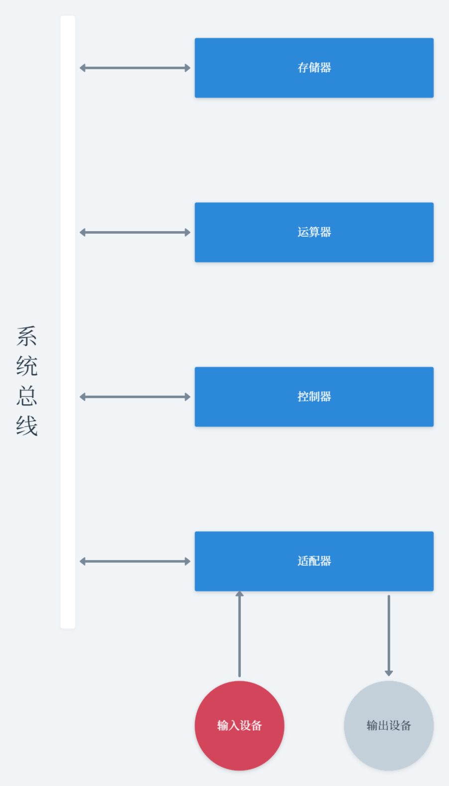
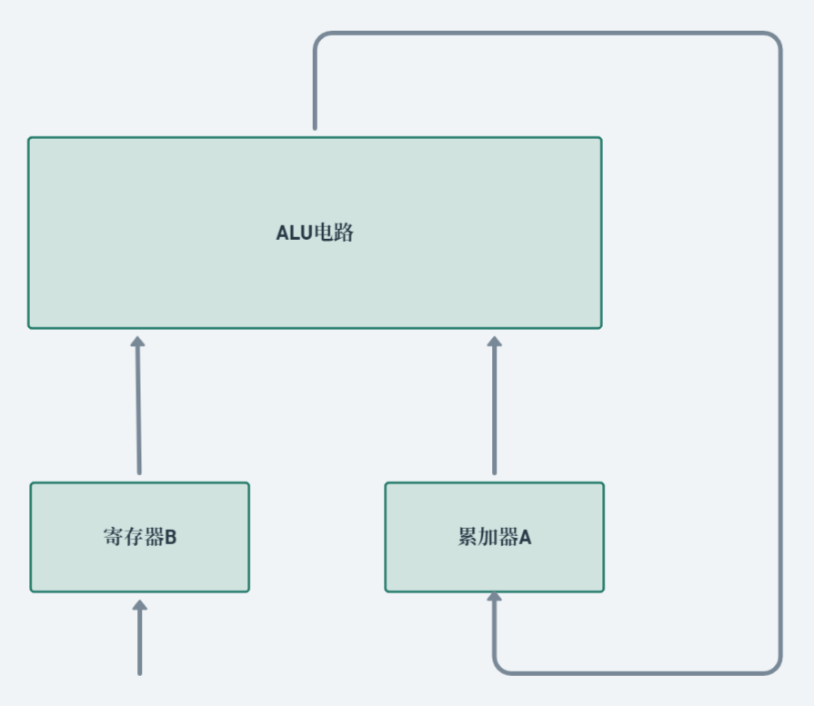
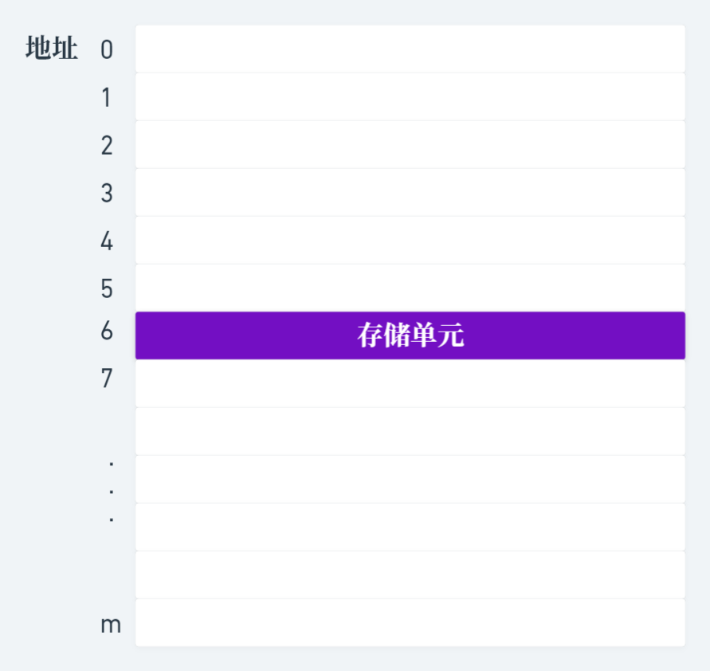

# 计算机组成原理

## 第一章　计算机系统概论

### 1.3.1 硬件组成要素

- 相当于算盘功能的部件，我们称之为运算器；相当于纸那样具有“记忆”功能的部件我们称之为存储器；相当于笔那样把原始解题信息送到计算机或把计算机结果显示出来的设备，我们称之为输入设备或输出设备；而相当于人的大脑能够自动控制整个计算过程的，称之为控制器。图1.2所示为数字计算机的主要组成结构，其中双线及箭头表示数据代码传送通路。

    
     
    
图1-2&emsp;数字计算机主要组成结构

### 1.3.2 运算器

- 运算器就好像是由电子线路组成的算盘，图1.3是它的示意图。它的功能主要是进行加、减、乘、除等算数运算。除此之外，还可以进行逻辑运算，因此通常称为**ALU**(算数逻辑运算部件)。

    
     
    
图1-3&emsp;运算器结构示意图

### 1.3.3 存储器

- 存储器的功能是保存或“记忆”解题的原始数据和解题步骤。为此再运算前需要把参加运算的数据和解题步骤通过输入设备送到存储器中保存起来。
- 通常，在存储器中把保存一个数的16个触发器称为一个存储单元。存储器是由许多存储单元组成的。每个存储单元都有编号，称为地址。向存储器中

    
     
    
图1-4&emsp;存储器结构示意图

## 第二章 运算方法和运算器

### 计算题节选

- 12. 用`IEEE 32`位浮点格式表示如下的数

  (1) $-5$ (2) $-1.5$ (3) $384$ (4) $\frac{1}{16}$ (5) $-\frac{1}{32}$

(1)先转化为2进制，$(-5)_{10} = (-101)_{2}$

∴$S = 1$ 

然后移动移动小数点，使其在1、2位之间
$$
1.01 \times 2^2 \qquad e=2
$$
于是得到
$$
S=1,E=2+127=129, \qquad M=01
$$
最后得到32位浮点数的二进制存储格式为
$$
{\color{red}1}{\color{green}100\,0000\,1}010\,0000\,0000\,0000\,0000\,0000=(C0A00000)_{16}\\
*红色是符号位，绿色是阶码
$$

(2)先转化为2进制，$(-1.5)_{10} = (-1.1)_{2}$

∴$S = 1$ 

然后移动移动小数点，使其在1、2位之间
$$
1.1 \times 2^0 \qquad e = 0
$$
于是得到
$$
S=1,E=0+127=127, \qquad M=1
$$
最后得到32位浮点数的二进制存储格式为
$$
{\color{red}1}{\color{green}011\,1111\,1}100\,0000\,0000\,0000\,0000\,0000=(BFC00000)_{16}\\
*红色是符号位，绿色是阶码
$$

例题：$设x=2^{010} \times 0.11011011,y=2^{100}\times(-0.10101100),求x+y$

- 设浮点数的阶码用双符号位，尾数用单符号位的补码表示：

  - $[x]_浮=00\,010, 0.11011011$
  - $[y]_浮=00\,100, 1.01010100$
- 求阶差并对阶

  - $\Delta E=E_x - E_y = [E_x]_补+[-E_y]_补\\ 00\,010 + 11\,100=11\,110$
- $则浮点数X，应使M_x右移2位，E_x加2，\\ [x]_浮=00\,100,0.00110110({\color{green}11}),E_s = 00\,100$
- 尾数求和
  - $M_S= 1.10001010({\color{green}11})$
    - $M_S计算过程：$

$$
\frac{\quad0.00110110(11)\\
+1.01010100}{\quad1.10001010(11)}
$$

- 和的规格化处理$M_s = 1.10001010({\color{green}11})$

  - 结果尾数的符号位与最高数值位相同，应左归一位

  - $M_s = 1.0001010({\color{green}10}),E_s=00\,100-1=00\,011$
  
- 舍入处理

  - 采用0舍1进法

    - 计算过程

    $$
    \frac{\quad1.00010101\\+\qquad\qquad\,1}{\quad1.00010110}
    $$

    

  $\therefore M_s=1.00010110$

- 结果溢出判断
  - 阶码符号位为00，和不溢出
- 最终结果$S=X+Y = 00\,011,1.00010110\\=2^{011}\times(-0.11101010)$

## 第三章 存储系统

### 3.6 cache存储器 

- 记忆要点

1. `cache`是为了**解决CPU和主存之间速度不匹配**而采用的一项重要技术。

