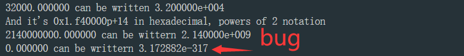

# Bug


## MinGW Bug

如果你使用下面的代码，`long double`会发生暴毙，打印出来的结果应该是这样的



```c
#include <stdio.h>

int main()
{
    float about = 32000.0;
    double abet = 2.14e9;
    long double dip = 5.32e-5;


    printf("%f can be written %e\n", about, about);
    printf("And it's %a in hexadecimal, powers of 2 notation\n", about);
    printf("%f can be wittern %e\n", abet, abet);
    printf("%Lf can be writtern %Le\n", dip, dip);

    return 0;

}
```


- 解决办法 
  1. 使用 `iostream`，没错换成C++问题解决了
  2. 或者你用MSVC(MSVC的 `double` 就等于 gcc 中的 `long double`) 
  3. 输出前转换成 `double`

```cpp
#include <iostream>
#include <cstdio>

int main()
{
    float about = 32000.0;
    double abet = 2.14e9;
    long double dip = 5.32e-5;


    printf("%f can be written %e\n", about, about);
    printf("And it's %a in hexadecimal, powers of 2 notation\n", about);
    printf("%f can be wittern %e\n", abet, abet);
    printf("%Lf can be writtern %Le\n", dip, dip);

    return 0;

}
```

